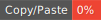

<p align="center">
  
</p>

## jscpd
[](https://www.npmjs.com/package/jscpd)

[](https://github.com/kucherenko/jscpd/blob/master/LICENSE)
[](https://www.npmjs.com/package/jscpd)


[](https://codecov.io/gh/kucherenko/jscpd)
[](https://app.fossa.io/projects/git%2Bgithub.com%2Fkucherenko%2Fjscpd?ref=badge_shield)
[](#backers)
[](#sponsors)

[](https://nodei.co/npm/jscpd/)

> Copy/paste detector for programming source code, supports [150+ formats](../../supported_formats.md).

Copy/paste is a common technical debt on a lot of projects. The jscpd gives the ability to find duplicated blocks implemented on more than 150 programming languages and digital formats of documents.
The jscpd tool implements [Rabin-Karp](https://en.wikipedia.org/wiki/Rabin%E2%80%93Karp_algorithm) algorithm for searching duplications.

## Table of content

- [Features](#features)
- [Getting started](#getting-started)
  - [Installation](#installation)
  - [Usage](#usage)
- [Options](#options)
- [Config File](#config-file)
- [Ignored Blocks](#ignored-blocks)
- [Reporters](#jscpd-reporters)
  - [HTML](#html)
  - [Badge](#badge)
  - [PMD CPD XML](#pmd-cpd-xml)
  - [JSON](#json-reporters)
- [API](#api)
- [Changelog](#changelog)
- [Who uses jscpd](#who-uses-jscpd)
- [Contributors](#contributors)
- [Backers](#backers)
- [Sponsors](#sponsors)
- [License](#license)


## Features
 - Detect duplications in programming source code, use semantic of programing languages, can skip comments, empty lines etc.
 - Detect duplications in embedded blocks of code, like `<script>` or `<style>` sections in html
 - Blame authors of duplications
 - Generate XML report in pmd-cpd format, JSON report, [HTML report](http://kucherenko.github.io/jscpd-report.html)
 - Integrate with CI systems, use thresholds for level of duplications

## Getting started

### Installation
```bash
$ npm install -g jscpd
```
### Usage
```bash
$ npx jscpd /path/to/source
```
or

```bash
$ jscpd /path/to/code
```
or

```bash
$ jscpd --pattern "src/**/*.js"
```
## Options
### Pattern

Glob pattern for find files to detect

 - Cli options: `--pattern`, `-p`
 - Type: **string**
 - Default: "**/*"

Example:
 ```bash
 $ jscpd --pattern "**/*.js"
 ```

### Min Tokens

Minimal block size of code in tokens. The block of code less than `min-tokens` will be skipped.

 - Cli options: `--min-tokens`, `-k`
 - Type: **number**
 - Default: **50**

 *This option is called ``minTokens`` in the config file.*

### Min Lines

Minimal block size of code in lines. The block of code less than `min-lines` will be skipped.

 - Cli options: `--min-lines`, `-l`
 - Type: **number**
 - Default: **5**
### Max Lines

Maximum file size in lines. The file bigger than `max-lines` will be skipped.

 - Cli options: `--max-lines`, `-x`
 - Type: **number**
 - Default: **1000**
### Max Size

Maximum file size in bytes. The file bigger than `max-size` will be skipped.

 - Cli options: `--max-size`, `-z`
 - Type: **string**
 - Default: **100kb**
### Threshold

The threshold for duplication level, check if current level of duplications bigger than threshold jscpd exit with error.

 - Cli options: `--threshold`, `-t`
 - Type: **number**
 - Default: **null**
### Config

The path to configuration file. The config should be in `json` format. Supported options in config file can be the same with cli options.

 - Cli options: `--config`, `-c`
 - Type: **path**
 - Default: **null**
### Ignore

The option with glob patterns to ignore from analyze. For multiple globs you can use comma as separator.
Example:
```bash
$ jscpd --ignore "**/*.min.js,**/*.map" /path/to/files
```
 - Cli options: `--ignore`, `-i`
 - Type: **string**
 - Default: **null**
### Reporters
The list of reporters. Reporters use for output information of clones and duplication process.

Available reporters:
 - **console** - report about clones to console;
 - **consoleFull** - report about clones to console with blocks of code;
 - **json** - output `jscpd-report.json` file with clones report in json format;
 - **xml** - output `jscpd-report.xml` file with clones report in xml format;
 - **csv** - output `jscpd-report.csv` file with clones report in csv format;
 - **markdown** - output `jscpd-report.md` file with clones report in markdown format;
 - **html** - generate html report to `html/` folder;
 - **sarif** - generate a report in SARIF format (https://github.com/oasis-tcs/sarif-spec), save it to `jscpd-sarif.json` file;
 - **verbose** - output a lot of debug information to console;

> Note: A reporter can be developed manually, see [@jscpd/finder](../finder) package.

 - Cli options: `--reporters`, `-r`
 - Type: **string**
 - Default: **console**
### Output

The path to directory for reports. JSON and XML reports will be saved there.

 - Cli options: `--output`, `-o`
 - Type: **path**
 - Default: **./report/**

### Mode
The mode of detection quality.
 - `strict` - use all types of symbols as token, skip only blocks marked as ignored.
 - `mild` - skip blocks marked as ignored and new lines and empty symbols.
 - `weak` - skip blocks marked as ignored and new lines and empty symbols and comments.

> Note: A mode can be developed manually, see API section.

 - Cli options: `--mode`, `-m`
 - Type: **string**
 - Default: **mild**
### Format

The list of formats to detect for duplications. Available over [150 formats](../../supported_formats.md).

Example:
```bash
$ jscpd --format "php,javascript,markup,css" /path/to/files
```

 - Cli options: `--format`, `-f`
 - Type: **string**
 - Default: **{all formats}**
### Blame
Get information about authors and dates of duplicated blocks from git.

 - Cli options: `--blame`, `-b`
 - Type: **boolean**
 - Default: **false**
### Silent
Don't write a lot of information to a console.

Example:
```
$ jscpd /path/to/source --silent
Duplications detection: Found 60 exact clones with 3414(46.81%) duplicated lines in 100 (31 formats) files.
Execution Time: 1381.759ms
```
 - Cli options: `--silent`, `-s`
 - Type: **boolean**
 - Default: **false**
### Absolute
Use the absolute path in reports.


 - Cli options: `--absolute`, `-a`
 - Type: **boolean**
 - Default: **false**
### Ignore Case
Ignore case of symbols in code (experimental).


 - Cli options: `--ignoreCase`
 - Type: **boolean**
 - Default: **false**

### No Symlinks
Do not follow symlinks.

 - Cli options: `--noSymlinks`, `-n`
 - Type: **boolean**
 - Default: **false**

### Skip Local
Use for detect duplications in different folders only. For correct usage of `--skipLocal` option you should provide list of path's with more than one item.

Example:
```bash
jscpd --skipLocal /path/to/folder1/ /path/to/folder2/
```
will detect clones in separate folders only, clones from same folder will be skipped.


 - Cli options: `--skipLocal`
 - Type: **boolean**
 - Default: **false**

### Formats Extensions
Define the list of formats with file extensions. Available over [150 formats](../../supported_formats.md).

In following example jscpd will analyze files `*.es` and `*.es6` as javascript and `*.dt` files as dart:
```bash
$ jscpd --formats-exts javascript:es,es6;dart:dt /path/to/code
```
> Note: formats defined in the option redefine default configuration, you should define all need formats manually or create two configuration for run `jscpd`

 - Cli options: `--formats-exts`
 - Type: **string**
 - Default: **null**

### Store

Stores used for collect information about code, by default all information collect in memory.

Available stores:
 - **leveldb** - leveldb store all data to files. The store recommended as store for big repositories. Should install @jscpd/leveldb-store before;

> Note: A store can be developed manually, see [@jscpd/finder](../finder) package and [@jscpd/leveldb-store](../leveldb-store) as example.

 - Cli options: `--store`
 - Type: **string**
 - Default: **null**

### Ignore Pattern
Ignore code blocks matching the regexp patterns.

 - Cli options: `--ignore-pattern`
 - Type: **string**
 - Default: **null**

Example:
```
$ jscpd /path/to/source --ignore-pattern "import.*from\s*'.*'"
```
Excludes import statements from the calculation.

## Config File

Put `.jscpd.json` file in the root of the projects:
```json
{
  "threshold": 0,
  "reporters": ["html", "console", "badge"],
  "ignore": ["**/__snapshots__/**"],
  "absolute": true
}
```

Also you can use section in `package.json`:

```json
{
  ...
  "jscpd": {
    "threshold": 0.1,
    "reporters": ["html", "console", "badge"],
    "ignore": ["**/__snapshots__/**"],
    "absolute": true,
    "gitignore": true
  }
  ...
}


```

### Exit code

By default, the tool exits with code 0 even code duplications were
detected. This behaviour can be changed by specifying a custom exit
code for error states.

Example:
```bash
jscpd --exitCode 1 .
```

- Cli options: `--exitCode`
- Type: **number**
- Default: **0**


## Ignored Blocks

Mark blocks in code as ignored:
```javascript
/* jscpd:ignore-start */
import lodash from 'lodash';
import React from 'react';
import {User} from './models';
import {UserService} from './services';
/* jscpd:ignore-end */
```

```html
<!--
// jscpd:ignore-start
-->
<meta data-react-helmet="true" name="theme-color" content="#cb3837"/>
<link data-react-helmet="true" rel="stylesheet" href="https://static.npmjs.com/103af5b8a2b3c971cba419755f3a67bc.css"/>
<link data-react-helmet="true" rel="stylesheet" href="https://static.npmjs.com/cms/flatpages.css"/>
<link data-react-helmet="true" rel="apple-touch-icon" sizes="120x120" href="https://static.npmjs.com/58a19602036db1daee0d7863c94673a4.png"/>
<link data-react-helmet="true" rel="apple-touch-icon" sizes="144x144" href="https://static.npmjs.com/7a7ffabbd910fc60161bc04f2cee4160.png"/>
<link data-react-helmet="true" rel="apple-touch-icon" sizes="152x152" href="https://static.npmjs.com/34110fd7686e2c90a487ca98e7336e99.png"/>
<link data-react-helmet="true" rel="apple-touch-icon" sizes="180x180" href="https://static.npmjs.com/3dc95981de4241b35cd55fe126ab6b2c.png"/>
<link data-react-helmet="true" rel="icon" type="image/png" href="https://static.npmjs.com/b0f1a8318363185cc2ea6a40ac23eeb2.png" sizes="32x32"/>
<!--
// jscpd:ignore-end
-->
```

## Reporters

### HTML

[Demo report](http://kucherenko.github.io/jscpd-report.html)
### Badge


More info [jscpd-badge-reporter](https://github.com/kucherenko/jscpd-badge-reporter)
### PMD CPD XML
```xml
<?xml version="1.0" encoding="utf-8"?>
<pmd-cpd>
  <duplication lines="10">
      <file path="/path/to/file" line="1">
        <codefragment><![CDATA[ ...first code fragment... ]]></codefragment>
      </file>
      <file path="/path/to/file" line="5">
        <codefragment><![CDATA[ ...second code fragment...}]]></codefragment>
      </file>
      <codefragment><![CDATA[ ...duplicated fragment... ]]></codefragment>
  </duplication>
</pmd-cpd>
```
### JSON reporters
```json
{
  "duplicates": [{
      "format": "javascript",
      "lines": 27,
      "fragment": "...code fragment... ",
      "tokens": 0,
      "firstFile": {
        "name": "tests/fixtures/javascript/file2.js",
        "start": 1,
        "end": 27,
        "startLoc": {
          "line": 1,
          "column": 1
        },
        "endLoc": {
          "line": 27,
          "column": 2
        }
      },
      "secondFile": {
        "name": "tests/fixtures/javascript/file1.js",
        "start": 1,
        "end": 24,
        "startLoc": {
          "line": 1,
          "column": 1
        },
        "endLoc": {
          "line": 24,
          "column": 2
        }
      }
  }],
  "statistic": {
    "detectionDate": "2018-11-09T15:32:02.397Z",
    "formats": {
      "javascript": {
        "sources": {
          "/path/to/file": {
            "lines": 24,
            "sources": 1,
            "clones": 1,
            "duplicatedLines": 26,
            "percentage": 45.33,
            "newDuplicatedLines": 0,
            "newClones": 0
          }
        },
        "total": {
          "lines": 297,
          "sources": 1,
          "clones": 1,
          "duplicatedLines": 26,
          "percentage": 45.33,
          "newDuplicatedLines": 0,
          "newClones": 0
        }
      }
    },
    "total": {
      "lines": 297,
      "sources": 6,
      "clones": 5,
      "duplicatedLines": 26,
      "percentage": 45.33,
      "newDuplicatedLines": 0,
      "newClones": 0
    }
  }
}
```
## API


For integration copy/paste detection to your application you can use programming API:

`jscpd` Promise API
```typescript
import {IClone} from '@jscpd/core';
import {jscpd} from 'jscpd';

const clones: Promise<IClone[]> = jscpd(process.argv);
```

`jscpd` async/await API
```typescript
import {IClone} from '@jscpd/core';
import {jscpd} from 'jscpd';
(async () => {
  const clones: IClone[] = await jscpd(['', '', __dirname + '/../fixtures', '-m', 'weak', '--silent']);
  console.log(clones);
})();

```

`detectClones` API
```typescript
import {detectClones} from "jscpd";

(async () => {
  const clones = await detectClones({
    path: [
      __dirname + '/../fixtures'
    ],
    silent: true
  });
  console.log(clones);
})()
```

`detectClones` with persist store
```typescript
import {detectClones} from "jscpd";
import {IMapFrame, MemoryStore} from "@jscpd/core";

(async () => {
  const store = new MemoryStore<IMapFrame>();

  await detectClones({
    path: [
      __dirname + '/../fixtures'
    ],
  }, store);

  await detectClones({
    path: [
      __dirname + '/../fixtures'
    ],
    silent: true
  }, store);
})()
```

In case of deep customisation of detection process you can build your own tool:
If you are going to detect clones in file system you can use [@jscpd/finder](../finder) for make a powerful detector.
In case of detect clones in browser or not node.js environment you can build your own solution base on [@jscpd/code](../core)

## Changelog
[Changelog](CHANGELOG.md)

## Who uses jscpd
 - [Code-Inspector](https://www.code-inspector.com/) is a code analysis and technical debt management service.
 - [Mega-Linter](https://nvuillam.github.io/mega-linter/) is a 100% open-source linters aggregator for CI (GitHub Action & other CI tools) or to run locally
 - [vscode-jscpd](https://marketplace.visualstudio.com/items?itemName=paulhoughton.vscode-jscpd) VSCode Copy/Paste detector plugin.

## Contributors

This project exists thanks to all the people who contribute.
<a href="https://github.com/kucherenko/jscpd/contributors"></a>
## Backers

Thank you to all our backers! 🙏 [[Become a backer](https://opencollective.com/jscpd#backer)]

<a href="https://opencollective.com/jscpd#backers" target="_blank"></a>
## Sponsors

Support this project by becoming a sponsor. Your logo will show up here with a link to your website. [[Become a sponsor](https://opencollective.com/jscpd#sponsor)]

<a href="https://opencollective.com/jscpd/sponsor/0/website" target="_blank"></a>
<a href="https://opencollective.com/jscpd/sponsor/1/website" target="_blank"></a>
<a href="https://opencollective.com/jscpd/sponsor/2/website" target="_blank"></a>
<a href="https://opencollective.com/jscpd/sponsor/3/website" target="_blank"></a>
<a href="https://opencollective.com/jscpd/sponsor/4/website" target="_blank"></a>
<a href="https://opencollective.com/jscpd/sponsor/5/website" target="_blank"></a>
<a href="https://opencollective.com/jscpd/sponsor/6/website" target="_blank"></a>
<a href="https://opencollective.com/jscpd/sponsor/7/website" target="_blank"></a>
<a href="https://opencollective.com/jscpd/sponsor/8/website" target="_blank"></a>
<a href="https://opencollective.com/jscpd/sponsor/9/website" target="_blank"></a>


## License

[MIT](LICENSE) © Andrey Kucherenko
